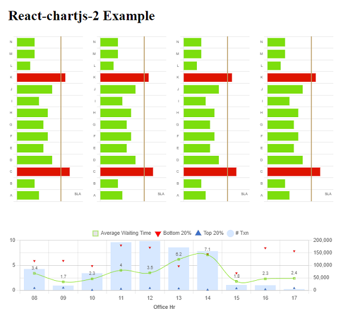

# react-chartjs-2-example

An example `vite` site for demonstrating the library `react-chartjs-2` with a multi-type chart and the `annotation` and `datalabels` plugin.



## Install

```
npm i
```

## Available Scripts

### Start the demo server
```
npm run dev
```

### Build the page
```
npm run build
```

### Preview the build content
```
npm run preview
```
